通过假数据布局页面，后期请求渲染真实数据


mint-ui Messagebox的组件bug，会导致数据渲染乱序,2022.07.12亲测，避免使用。


# axios的二次封装


# CSS布局

display: flex;

position: fixed;


# 单位

rem、vh、vw


数据的懒加载

element-ui el-image lazy

vant2 lazy

mint-ui的lazy-load组件


# 插件

better-scroll

默认会关闭点击事件，导致应用滚动的页面元素的点击事件失效,在使用时要注意添加配置项click:true


vue-some-swiper


qs


keep-alive

提高性能


# token

token类似一个令牌,是一种可以校验身份的数据。


token使用流程

1.客户端使用用户名和密码请求登录

2.服务器收到请求，去验证用户名与密码

3.验证成功后，服务端会签发一个Token，再把Token发送给客户端

4.客户端收到Token以后将其存储起来，每次向服务器请求资源的时候需要携带token

5.服务器收到请求后，先验证客户端的token，如果验证通过即返回数据。


# 依赖包

运行依赖


开发依赖


后端下载

jsonwebtoken

mysql


# Vant-ui

在编辑地址,显示地址信息的时候areacode不能丢，地区识别需要


# 支付宝沙箱

## 一、配置沙箱环境

### 1、入驻支付宝开发平台

> 1.1 访问[https://open.alipay.com](https://links.jianshu.com/go?to=https%3A%2F%2Fopen.alipay.com)，入驻支付宝开发平台。

> 1.2 登录后出现提示,选择`立即入驻`

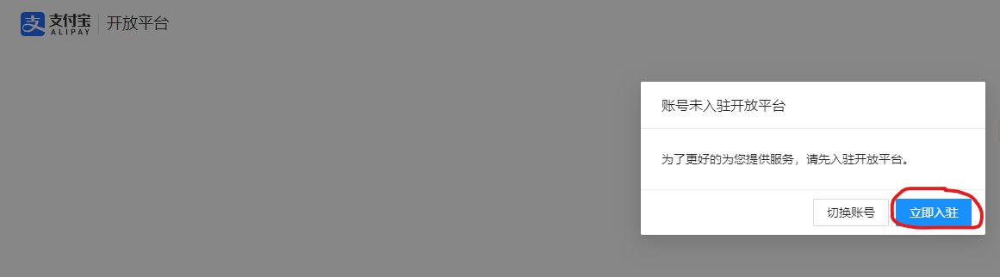


> 1.3 填写信息

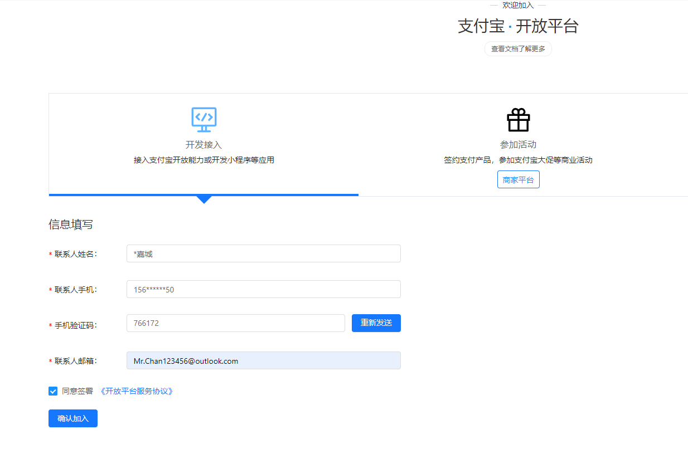


> 1.4 进入沙箱环境

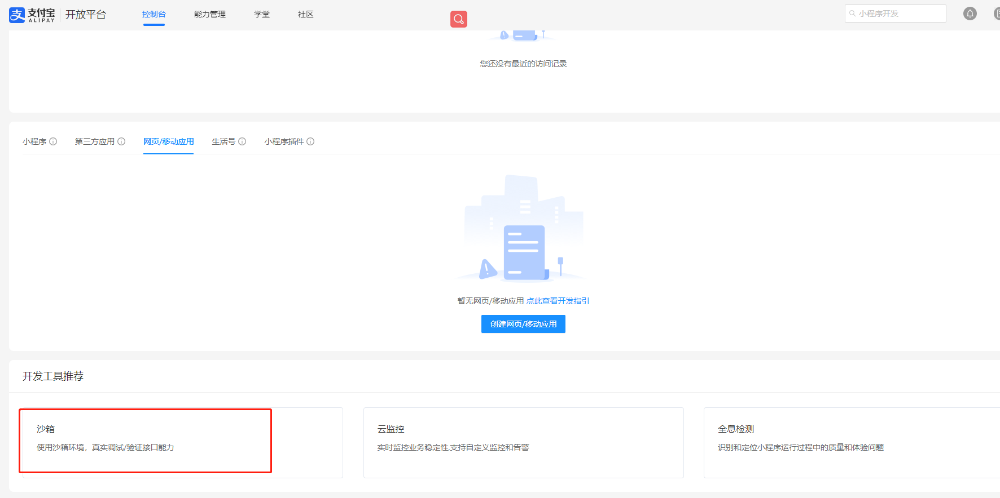

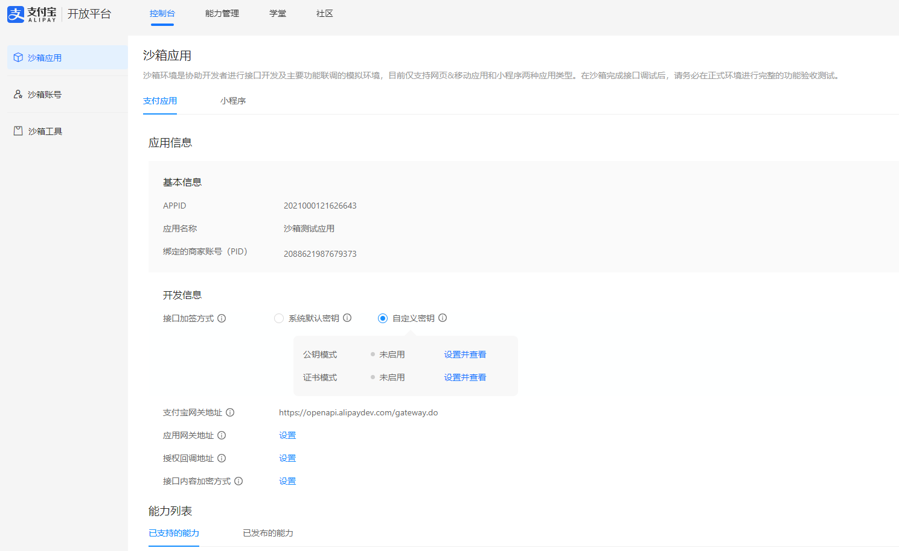


> 1.5 下载支付宝开放平台开发助手

> 生成公私钥


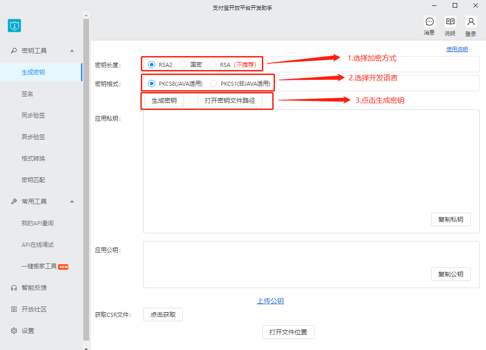

> 设置公钥

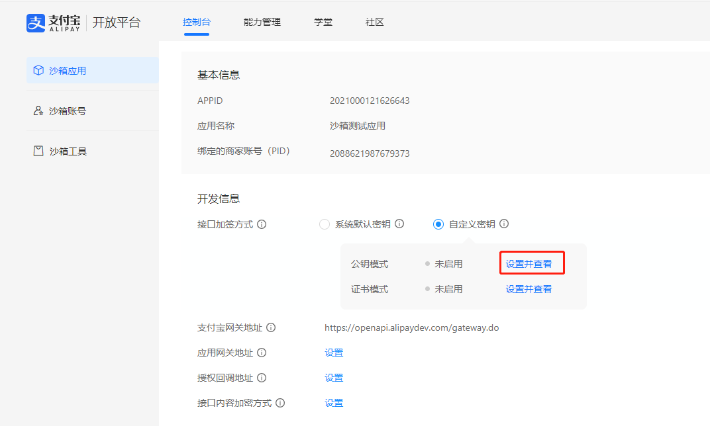

> 复制从开发平台助手工具上生成的应用公钥进行填写

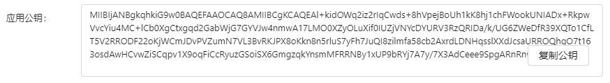

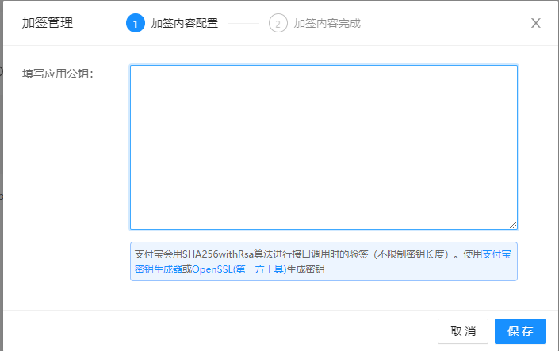


### 2、引入并配置SDK(Node端)

SDK for Node.js的Github链接[alipay/alipay-sdk-nodejs-all: 支付宝开放平台 Alipay SDK for Node.js (github.com)](https://github.com/alipay/alipay-sdk-nodejs-all)

以及SDK配置相关信息的官网[SDK 配置 · 语雀 (yuque.com)](https://www.yuque.com/chenqiu/alipay-node-sdk/config-sdk#rKxMv)

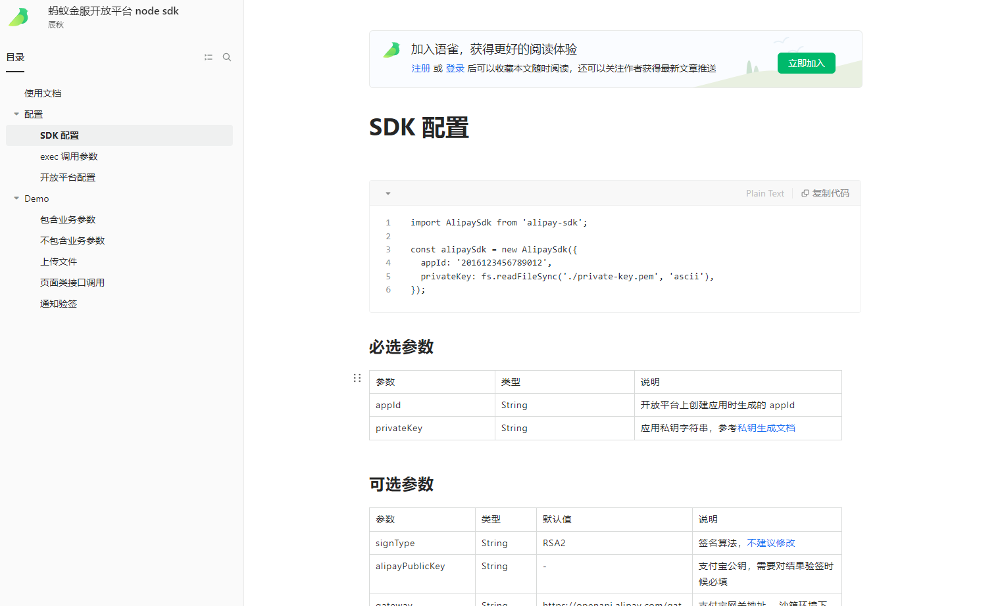

> 2.1 NPM安装包npm install alipay-sdk --save

使用cnpm会报错，尽量用npm


> 2.2 新建支付的配置文件alipay.js

```js
//引入sdk,引入这部分跟官网文档不同,以这里为准
const AlipaySdk = require('alipay-sdk').default
const alipaySdk = new AlipaySdk({
  //appId
  appId: '2021000121626643',
  //签名算法,默认RSA2
  signType: 'RSA2',
  //支付宝网关地址
  gateway: 'https://openapi.alipaydev.com/gateway.do',
  //支付宝公钥
  alipayPublicKey:
    'MIIBIjANBgkqhkiG9w0BAQEFAAOCAQ8AMIIBCgKCAQEA6X4zDo0e51ZpwSumw6Lo3QiziCp8Id9+PGGkwevVlf65ybS73AX1SdpIfmNGG5sJGNxq1oPVu6grGSm0pCHttMUkrJoeEbM0bAiDCoTwHB+hzvp9ArqJ177JOav8VuWdR7dYeFOXI30toJbQPtIJTKtglHtC7xUFtHqUKdTw/B0v4sCniufUT3oXTYBrLouT7bFjfEomr5tr+YHieAwaI7CQeQDy89jEcv+/8U0mib/jOgb9/ORXTre8AVxdn9XSM2iSZkADSElVanLmsrAP3qrcjnHY3GNCuqGHWLKxH42c27mArRzvgBiiUdhIbHkl/Ha4VWQp1Blzu2yZDBZizwIDAQAB',
  //应用私钥
  privateKey:
    'MIIEpQIBAAKCAQEAl+kidOWq2iz2rIqCwds+8hVpejBoUh1kK8hj1chFWookUNIADx+RkpwVvcYiu4MC+lCb0XgCtxgqd2GabWjG7GYVJw4nmwA17LMO0XZyOLuXif0IUZjVNYcDYURV3RzQRIDa/k/UG6ZWeDfR39XQTo1CfLT5V2RRODF22oKjWCmJDvPVZumN7VL3BvRKJPX8oKkn8n5rluS7yFh7JuQI8zilmfa58cb2AxrdLDNHqsslXXdJcsaURROQhgO7t163osdAwHCvwZiSCqpv1X9oqFiCcRyuzGSoiSX6GmgzqkYnsmMFRRNBy1xUP9bRYj7A7y/7X3AdCeee9SpgARnRnwIDAQABAoIBAQCJDX3Xx0lQk5Ztbn2v1lVA5Y6G/dtwkjHIyn8/5fKkT9OZ0wzYmBunEQkQcQzu7bEnEsixwDt64uOVV0qTAR/PMf5NgRi8YAFGrvlkgx9kDeMXTGFP9LoPE+M5wwRQe+lulG5/WJg95eFHjtzbvDS2Wf2tMz1t2gTo1L+tPoWOSG0JAgv5xdHYmGN4hJ+AIJB8VH4kkWZf2I0yfoAnsQvFZ9wQ2bF6AI+nqZxeCxZTt8ErpX/GVWTftZVsoQ4ia62lNto06iBSnLLYptvEJsbyRfMBsd+GXxj4/4yL97kq7F6EfOQBrw2/qzE2LaKPqMySEzEprnDhY/jlCnQGhWfJAoGBANuXZ4T9zrcqx5sSihhG2eNVCK16W6hM4PNBVAmiGBfeLADPHgerQvUhjMDD6FPydI8sGpvCCue3pdtrOhWSdSPdwGwBT3T2oMHyGx2qmDINxMe5SKvMmkU1WoGvK08bDpYzk6mhUFAbRxhurVgYbX3gc49tTpYN0UhmWmbCDsltAoGBALEZAnHYUmCMt4wmDLef/wJtNTRhY8THB6C7uCXKxrAWcxBu8jJaQAVDAG+DL8pa9cRqITIcCM93Zs0RgvAeZsKvs3CdkJeG1hq9/SiL5xDPWg6aPn17+t2hmLqMRaNdajpSkVZ1fF1H+fhk19kHZzXOFQpJVzv8rT4y+XJ6GQu7AoGBANKgBdZFUFrWeMDgZn7krqfj7z/eZj4nB3msBrx6sttp6hEYmLhIaCAR/x0CjDzBCVYuupL961HZEAhHcF4yrZMqZx/xndIVoZqF68Zn1DXmiQH9UZwf0zVg+J/9cfAdhr9BV3hUV2GO2IGx3yjpvVQIzy8abE93j27/ZeS8bEx9AoGANd0ydifiXkVOak0EXzFFoZpPrV/VtXsHoeaWisATEGmzk5L7DT+P60nGryQKfBSQXa4d7JzEPT3GwaaK2beVb69690ylNsEnC7kvb46lt+IpNPnK+eWklpZY2pxhbd+yuIx2cgKH0eNbbyZU1EjBJodItPk7lB41Hw7n+d6TEZMCgYEAxIeHEB6YnW/sVeks0lgj984Va3Gajj5IoZEIRwk/csrZhNNhcq9moajaF9iGkYZ+4XRVMuLf4bT7/t83zrmi9dYPwnl1ArB9hP5+oMOK+tCk9R7ICPl2A/XNirsTknTRMi7HLu/oTMr8R0ymV7YbSKbmBXZdpiGnHmuOnqOZqok=',
})
module.exports = alipaySdk

```

**相关信息从沙箱管理页面找**

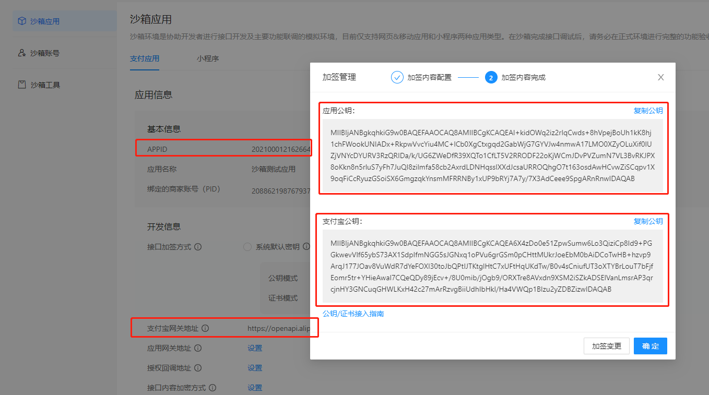


> 2.3 在接口处引入配置文件

```js
//引入支付宝配置文件
const alipaySdk = require('../db/alipay.js')
const AlipayFormData = require('alipay-sdk/lib/form').default
```

```js
接口业务逻辑.......

	  //对接支付宝API
      const formData = new AlipayFormData()
      //调用setMethod并传入get,返回可以跳转到支付页面的url
      formData.setMethod('get')
      //支付时显示的页面信息
      formData.addField('bizContent', {
        outTradeNo: data.order_id, //订单号
        productCode: 'FAST_INSTANT_TRADE_PAY', //写死的数据
        totalAmount: data.totalprice, //总价
        subject: '商品', //商品名称
      })
      //支付成功or失败跳转的链接
      formData.addField('returnUrl', 'http://localhost:8080/Payment') //临时使用的本地地址,上线后需要变更
      //返回Promise
      
      const result = alipaySdk.exec('alipay.trade.page.pay', {}, { formData: formData })
      result.then((resp) => {
        res.send({
          data: {
            code: 200,
            success: true,
            msg: '支付中',
            paymentUrl: resp,
          },
        })
      })
```


> 2.4 在前端打开返回的paymentUrl便是支付宝页面

接收url并打开url， window.location.href=res.paymentUrl

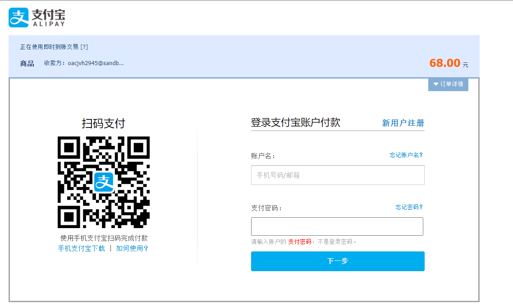

**通过提供的沙箱账号进行操作即可**

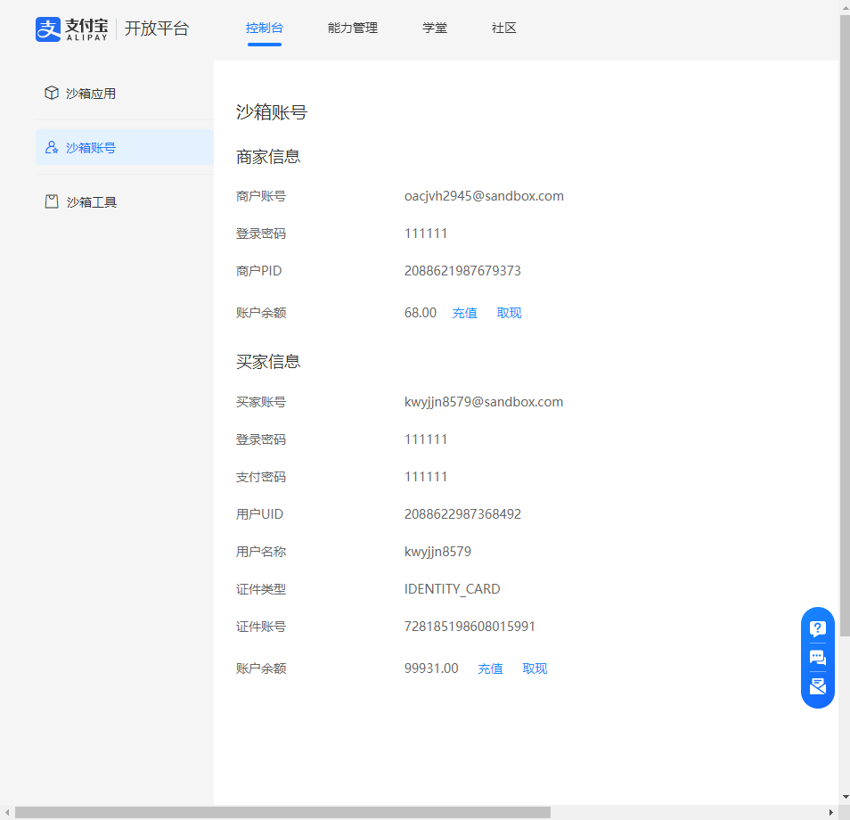